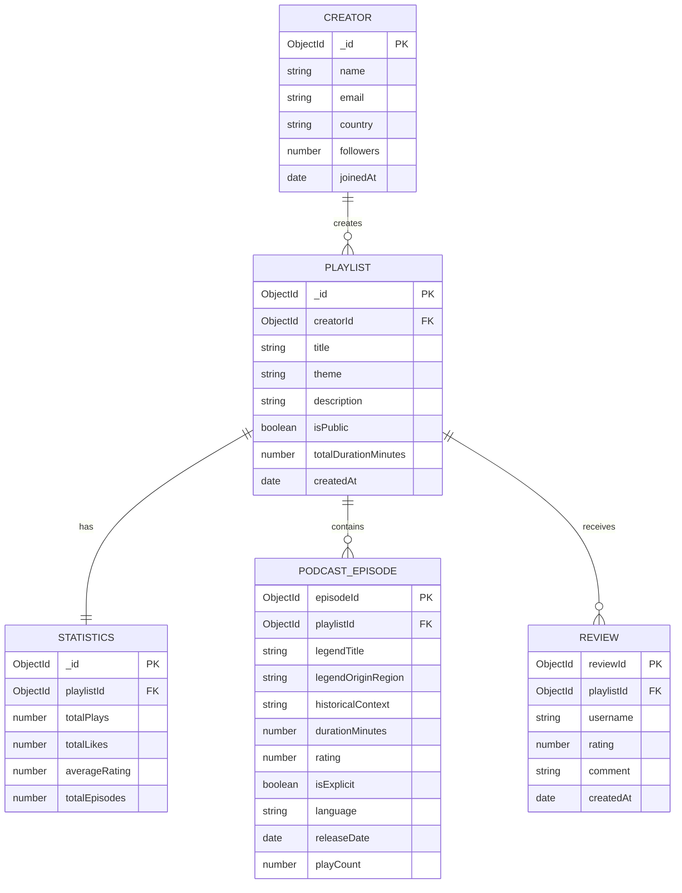

```mermaid
erDiagram

PLAYLIST {
    ObjectId _id PK
    ObjectId creatorId FK
    string title
    string theme
    string description
    boolean isPublic
    number totalDurationMinutes
    date createdAt
}

CREATOR {
    ObjectId _id PK
    string name
    string email
    string country
    number followers
    date joinedAt
}

STATISTICS {
    ObjectId _id PK
    ObjectId playlistId FK
    number totalPlays
    number totalLikes
    number averageRating
    number totalEpisodes
}

PODCAST_EPISODE {
    ObjectId episodeId PK
    ObjectId playlistId FK
    string legendTitle
    string legendOriginRegion
    string historicalContext
    number durationMinutes
    number rating
    boolean isExplicit
    string language
    date releaseDate
    number playCount
}

REVIEW {
    ObjectId reviewId PK
    ObjectId playlistId FK
    string username
    number rating
    string comment
    date createdAt
}

CREATOR ||--o{ PLAYLIST : creates
PLAYLIST ||--|| STATISTICS : has
PLAYLIST ||--o{ PODCAST_EPISODE : contains
PLAYLIST ||--o{ REVIEW : receives
```
