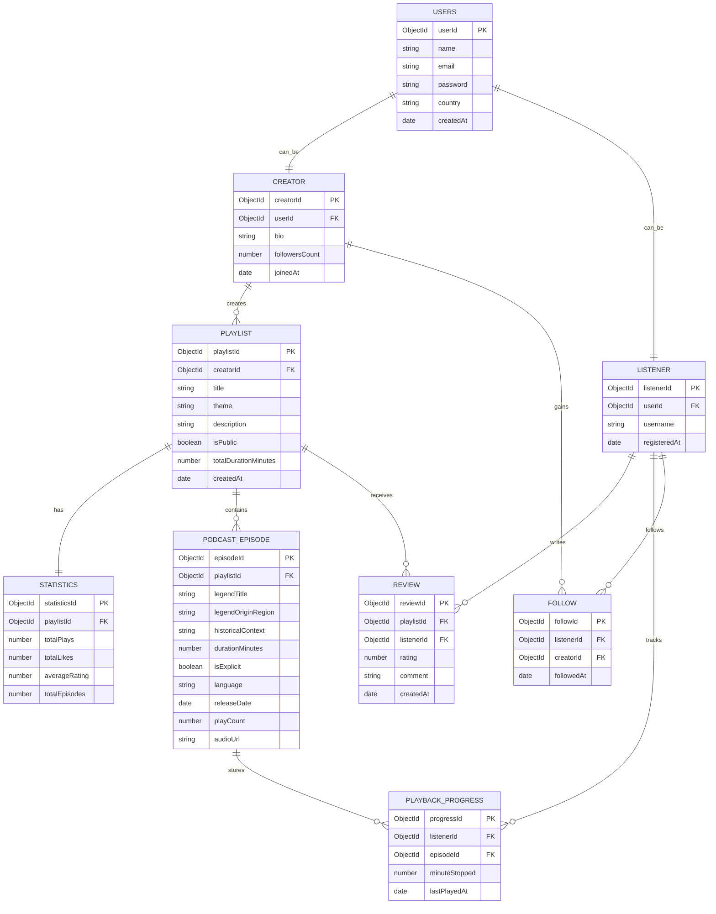

```mermaid
erDiagram

USERS {
    ObjectId userId PK
    string name
    string email
    string password
    string country
    date createdAt
}

CREATOR {
    ObjectId creatorId PK
    ObjectId userId FK
    string bio
    number followersCount
    date joinedAt
}

LISTENER {
    ObjectId listenerId PK
    ObjectId userId FK
    string username
    date registeredAt
}

FOLLOW {
    ObjectId followId PK
    ObjectId listenerId FK
    ObjectId creatorId FK
    date followedAt
}

PLAYLIST {
    ObjectId playlistId PK
    ObjectId creatorId FK
    string title
    string theme
    string description
    boolean isPublic
    number totalDurationMinutes
    date createdAt
}

STATISTICS {
    ObjectId statisticsId PK
    ObjectId playlistId FK
    number totalPlays
    number totalLikes
    number averageRating
    number totalEpisodes
}

PODCAST_EPISODE {
    ObjectId episodeId PK
    ObjectId playlistId FK
    string legendTitle
    string legendOriginRegion
    string historicalContext
    number durationMinutes
    boolean isExplicit
    string language
    date releaseDate
    number playCount
    string audioUrl
}

REVIEW {
    ObjectId reviewId PK
    ObjectId playlistId FK
    ObjectId listenerId FK
    number rating
    string comment
    date createdAt
}

PLAYBACK_PROGRESS {
    ObjectId progressId PK
    ObjectId listenerId FK
    ObjectId episodeId FK
    number minuteStopped
    date lastPlayedAt
}

USERS ||--|| CREATOR : can_be
USERS ||--|| LISTENER : can_be
CREATOR ||--o{ PLAYLIST : creates
PLAYLIST ||--|| STATISTICS : has
PLAYLIST ||--o{ PODCAST_EPISODE : contains
PLAYLIST ||--o{ REVIEW : receives
LISTENER ||--o{ REVIEW : writes
LISTENER ||--o{ PLAYBACK_PROGRESS : tracks
PODCAST_EPISODE ||--o{ PLAYBACK_PROGRESS : stores
LISTENER ||--o{ FOLLOW : follows
CREATOR ||--o{ FOLLOW : gains
```
